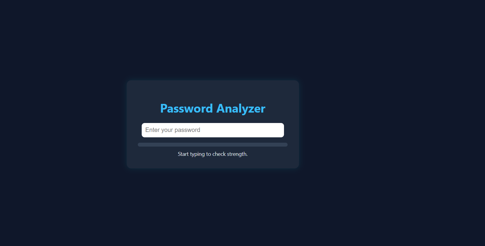

# 🔐 Password Analyzer Tool

A modern, responsive password strength analyzer built using **HTML**, **CSS**, and **JavaScript**. It gives real-time visual feedback and helps users create stronger passwords.

---

## 📸 Screenshot




---

## 🚀 Features

- Real-time password strength detection
- Visual strength meter (color bar)
- Feedback: "Very Weak" to "Very Strong"
- Checks:
  - Length (≥8)
  - Uppercase and lowercase
  - Digits and special characters

---

## 📁 How to Use

1. Clone or download this repo:
   ```bash
   git clone https://github.com/11gurmeet11/password-analyzer-tool.git
   cd password-analyzer-tool

---

🛠 Built With
---

HTML5

CSS3 (Dark UI theme)

Vanilla JavaScript


----

👩‍💻 Author
---
Gurmeet Kaur
GitHub: @11gurmeet11

---

📝 License
---
This project is licensed under the MIT License.


----

⭐️ Show Your Support
---
If you like this project, please give it a ⭐️ on GitHub — it helps more people find it!

yaml
Copy
Edit

---


